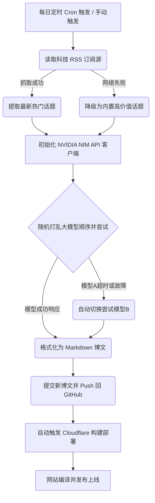

# 🤖 AI-Blog-Pulse | 全自动 AI 驱动的科技前沿博客

[](https://gohugo.io/)
[](https://github.com/dillonzq/LoveIt)
[](LICENSE)
[](https://build.nvidia.com)
[](https://github.com/3y3y3y-huaiji/hugo-blog-loveit-theme/actions)

> 💡 **这是一个全自动运行、智能撰写、零人工干预的科技博客站。** 
> 
> 本项目基于 **Hugo (Extended)** 静态站点生成器和重构版 **LoveIt v0.3.1** 主题，通过对接 **NVIDIA API Catalog** 大模型资源池与主流科技媒体 **RSS 订阅源**，实现每日自动追踪全球科技热点、自主撰写深度技术分析博文，并全自动编译部署到 **Cloudflare Workers** 边缘网络。

🌐 **在线访问**：[https://berry.ccwu.cc/](https://berry.ccwu.cc/)

---

## 🌟 核心功能特性

* **🤖 多模型智能撰写**：内置 5 大国产与开源顶尖模型资源池，每次随机指派。
  * `DeepSeek V4 Pro` / `Kimi K2.6` / `MiniMax M3` / `GLM 5.1` / `Gemma 4 31B`
* **📡 动态热点抓取**：实时读取少数派（SSPAI）、Solidot 奇客、Hacker News、TechCrunch 等优质科技 RSS 订阅源，自动追踪当日最火科技动态。
* **🛡️ 工业级容灾弹性（Model Fallback）**：具备自动防挂死及多模型轮询回退逻辑。若首选模型响应超时（设定 2 分钟）或报错，脚本将自动秒级切换至备用模型，保证流水线 100% 成功。
* **⚡ 优美的主题与极致性能**：
  * 主题升级至 **LoveIt v0.3.1**，采用 TypeScript 核心重写并自动 Babel 编译。
  * 内置 **Lunr.js** 搜索引擎，支持中文分词的毫秒级本地全文搜索。
  * 完美适配暗色/浅色模式、Mermaid 时序图绘制、移动端自适应。

---

## 📂 项目结构

```text
hugo-blog-loveit-theme/
├── .agents/
│   └── AGENTS.md             # AI Agent 统一行为规范
├── .github/
│   └── workflows/
│       ├── ai-blog-cron.yml  # 定时 AI 撰写 → 自动 Push → 触发部署
│       └── cloudflare-deploy.yml  # Push 触发：Lint → Build → 部署 Cloudflare
├── content/
│   ├── about/                # "关于"页面（含 Mermaid 架构图）
│   └── posts/                # 博客文章目录（含 AI 自动生成的博文）
├── scripts/
│   └── generate-ai-post.ts   # AI 博文自动生成核心 TypeScript 脚本
├── themes/
│   └── LoveIt/               # LoveIt 主题（已完成 TS 适配）
├── hugo.toml                 # Hugo 站点全局配置
├── package.json              # 依赖与构建脚本
├── wrangler.jsonc             # Cloudflare Workers Assets 配置
└── docs/                     # 项目开发文档
```

---

## ⚙️ 工作流架构图



---

## 🛠️ 部署教程

### 方案一：Cloudflare Workers Assets 自动部署（推荐）

这是本项目的默认部署方式，通过 GitHub Actions 全自动构建并部署到 Cloudflare 边缘网络。

#### 1. 配置仓库 Secrets

进入 GitHub 仓库 **Settings** → **Secrets and variables** → **Actions**，添加以下 Secrets：

| Secret 名称 | 说明 |
|-------------|------|
| `NVIDIA_API_KEY` | 从 [NVIDIA Build](https://build.nvidia.com/) 获取的 `nvapi-` 开头密钥 |
| `CLOUDFLARE_API_TOKEN` | Cloudflare API Token（需要 Workers 编辑权限） |
| `CLOUDFLARE_ACCOUNT_ID` | Cloudflare 账户 ID |

#### 2. 运行与验证

* 代码推送到 `main` 分支后，会自动触发构建并部署到 Cloudflare。
* 访问仓库的 **Actions** 标签页，选择 **Auto Generate AI Post**，点击 **Run workflow** 手动运行一次，即可看到 AI 生成文章并自动部署的全流程。

---

### 方案二：本地预览与开发

#### 1. 前置依赖

* [Hugo Extended](https://gohugo.io/getting-started/installing/) (v0.163.0+)
* [Node.js](https://nodejs.org/) (v20+)

#### 2. 本地初始化

```bash
# 克隆仓库
git clone https://github.com/3y3y3y-huaiji/hugo-blog-loveit-theme.git
cd hugo-blog-loveit-theme

# 安装 Node 依赖
npm install
```

#### 3. 配置本地环境变量

在项目根目录创建 `.env` 文件（已被 `.gitignore` 保护）：

```env
NVIDIA_API_KEY=nvapi-your-real-nvidia-api-key-here
```

#### 4. 本地测试运行

```bash
# 编译主题核心 JS 资源
npm run build:theme

# 调用 AI 撰写一篇新文章
npm run generate:ai-post

# 启动本地预览服务器
hugo server -D
```

---

## 📝 贡献与开发指南

1. **类型检查**：`npm run typecheck`
2. **代码风格检查**：`npm run lint`
3. **AI Agent 开发规范**：参见 [`.agents/AGENTS.md`](.agents/AGENTS.md)

## 📄 许可证

本项目采用 [MIT 许可证](LICENSE) - 允许个人及商业性免费修改使用。

## 💖 致谢

* [Hugo](https://gohugo.io/) - 世界上最快的静态网站生成框架。
* [LoveIt Theme](https://github.com/dillonzq/LoveIt) - 精致而强大的 Hugo 博客主题。
* [NVIDIA Build Platform](https://build.nvidia.com) - 提供丰富且支持 OpenAI 兼容 API 接入的先进大模型服务。
* [Cloudflare Workers](https://workers.cloudflare.com/) - 高性能全球边缘静态托管。