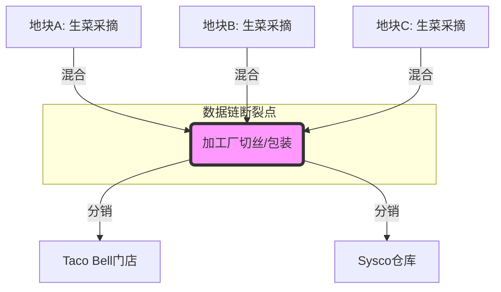

+++
title = "从一颗生菜看全球供应链的脆弱性与技术救赎之路"
date = 2026-07-18T13:55:24.537+08:00
draft = false
tags = ["AI Generated", "deepseek-v4-pro"]
categories = ["AI博客", "前沿技术"]
description = ""
author = "AI Writer"
+++

一颗看似普通的生菜，引爆了一场横跨美墨边境的食品安全危机，也让科技与供应链管理的深层矛盾浮出水面。

近日，北美知名农产品供应商 Taylor Farms 宣布，因环孢子虫病（Cyclosporiasis）爆发，主动从美国市场撤回所有产自墨西哥中部的 iceberg 生菜。受影响的客户名单堪称餐饮界的“全明星阵容”——包括百胜餐饮集团旗下的 Taco Bell 以及食品分销巨头 Sysco。Taco Bell 不得不在全国范围内紧急下架相关原料，并承诺在 24 小时内完成替换。这起事件看似是一次偶发的食品安全事故，但当我们用技术人的放大镜审视其背后的供应链架构、数据追溯能力以及农业科技现状时，会发现它揭示了一个远比寄生虫更顽固的系统性顽疾。

### 冰山一角：环孢子虫为何难以被“看见”

要理解这场危机的技术根源，我们首先得认识一下肇事者——环孢子虫（Cyclospora cayetanensis）。这是一种单细胞寄生虫，其卵囊（oocyst）极其微小，直径仅 8-10 微米，且具有极强的环境抗性。与常见的沙门氏菌或大肠杆菌不同，环孢子虫的检测存在几个令传统食品安全体系头疼的技术瓶颈：

1.  **富集与分离难题**：在复杂的生菜表面微生物群落中，环孢子虫卵囊密度通常极低。传统的微生物培养法对它完全无效，必须依赖过滤、离心等物理富集手段，回收率波动极大。
2.  **显微镜检测的局限性**：常规的光学显微镜难以区分环孢子虫与其他形态相似的藻类或杂质。即便使用紫外荧光显微镜，卵囊的自发荧光特性也不稳定，极度依赖检测人员的经验——而这正是自动化系统最难替代的环节。
3.  **分子检测的“黄金标准”之困**：PCR（聚合酶链式反应）技术虽然灵敏度高，但需要先有效裂解卵囊这一堪比“微型堡垒”的结构以释放 DNA。样本前处理的复杂步骤让快速现场检测几乎成为奢望，通常需要数天才能得到确认结果。

简而言之，环孢子虫是食品安全检测体系中典型的“边缘挑战者”。当供应链追求极致效率时，这类需要耗时、耗力且高度依赖人工经验的检测项目，往往成为第一个被有意无意压缩的环节。

### 供应链的“黑箱”迷雾：为何溯源如此艰难

Taylor Farms 的声明中提及了一个关键地点：墨西哥瓜纳华托州（Guanajuato）的一处加工设施，产品形式为 5 磅装的切丝生菜。这立刻暴露了现代农产品供应链中一个典型的“混合与聚合”难题。

让我们模拟一下这批生菜的数据旅程。在理想化的数字孪生模型中，每一颗从田间采摘的生菜都应携带一个唯一的数字身份，记录其产地坐标、采摘时间、施肥记录、灌溉水源检测结果。然而，现实是残酷的。当生菜进入加工厂，成百上千颗来自不同地块的生菜被混合、切丝、清洗、脱水，最终装入同一个 5 磅的包装袋。这一过程在物理上完成了产品的标准化，却在数据上制造了一个难以穿透的“黑箱”。

在当前的供应链实践中，追溯能力往往止步于加工批次（Lot Code）。一个批次可能对应数百个上游农户。当疫情爆发，公共卫生部门只能通过流行病学调查，反向统计患者共同的饮食暴露，来圈定可疑的餐厅和分销商，再由分销商倒查供应商。这种“反向追溯”效率低下，代价惨重。Taylor Farms 选择“主动撤回所有墨西哥中部产的生菜”，本质上是一种无奈的“地毯式轰炸”防御——因为缺乏精确制导的数据武器，只能牺牲整个产区的商业利益来换取公共安全。

### 技术的十字路口：IoT、AI 与区块链的承诺与幻象

每当此类危机发生，科技界总会祭出三面大旗：物联网（IoT）、人工智能（AI）和区块链。让我们冷静地审视这些技术在这场生菜危机中究竟能扮演什么角色，以及它们为何迟迟未能落地。

**物联网：感知层的成本悬崖**
在田间部署土壤湿度、温湿度传感器相对成熟，但直接监测微生物的 IoT 传感器仍是实验室里的圣杯。即使退一步，通过 IoT 记录农事操作（如灌溉、施肥）的完整日志，为污染风险提供间接证据链，其成本对于利润微薄的中小农户而言依然高不可攀。此次涉事的墨西哥中部产区，其数字化基础设施水平可能正是制约精准追溯的关键短板。

**人工智能：视觉检测的“黑天鹅”困境**
计算机视觉在农产品分选线上已经能出色地识别机械损伤、颜色异常甚至部分霉菌。然而，如前所述，环孢子虫卵囊在常规视觉系统下几乎是隐形的。AI 模型能够学习识别“正常”与“异常”，但面对这种发生率极低、视觉特征极度微弱的“黑天鹅”事件，训练数据的稀缺性让模型近乎无用武之地。AI 更现实的角色可能在流行病学调查阶段，通过自然语言处理加速病例报告的关联分析，而非在产线上进行预防性拦截。

**区块链：数据上链前的“预言机”悖论**
区块链常被包装成供应链溯源的灵丹妙药。然而，区块链只能保证链上数据不可篡改，却无法保证数据上链那一刻的真实性——这就是著名的“预言机问题”（Oracle Problem）。如果加工厂的混合操作没有自动化、可信的数据采集机制，而是依赖人工录入，那么即便将批次信息上链，我们得到的也只是一条永恒烙印的、可能不完整的记录。问题的核心不在于数据存储是否分布式，而在于数据采集是否自动化、无偏见。

### 超越技术堆栈：我们需要一场“农业即代码”的范式革新

真正深刻的变革或许不在于孤立地部署某种技术，而在于推动农业供应链走向“农业即代码”（Agriculture as Code）的范式。这意味着将农业生产和加工流程抽象为可编程、可验证、可审计的数字化工作流。

设想一下，如果 Taylor Farms 的加工厂执行一套开源的、标准化的数据采集协议（类似于工业互联网中的 OPC UA 标准），每一台切丝机、清洗池都作为数据节点，实时广播其处理的对象批次与操作参数。当来自地块 A 的生菜进入生产线时，系统自动生成一个 Merkle Tree 结构，将上游农事数据与加工参数打包成可加密验证的证明。当疫情发生时，公共卫生部门不再需要层层打电话，而是可以直接查询一个公开的、零知识证明保护商业隐私的异常事件日志，在几分钟内定位到受污染的地块，而不是召回整个国家的产品。

这听起来激进，但技术组件已基本成熟。我们需要跨越的，更多是商业利益与数据主权之间的博弈鸿沟。

### 结语：生菜的苦涩教训与未来的韧性供应链

Taylor Farms 的生菜召回事件，如同一面镜子，映照出全球化食品供应链在效率崇拜下积累的技术债务。我们拥有能送货上门的无人机、能聊天的通用人工智能，却依然无法在 24 小时内精准追踪一颗生菜上的寄生虫来源。这是一种令人警醒的技术失衡。

未来的韧性供应链，不应只是一套更快的危机公关流程，而应是一个深度融合生物检测技术、自动化数据采集与密码学验证的分布式信任网络。这场危机的正面遗产，或许将是推动整个行业承认：在食品安全面前，数据的透明度与可计算性，与冷链的低温同样重要。当每一颗生菜都能讲述它从种子到货架的完整、可信的数字故事时，我们才能说，科技真正守护了餐桌。

---

*本文由 NVIDIA API Catalog 托管的 **deepseek-ai/deepseek-v4-pro** 模型自动撰写并生成发布。*
