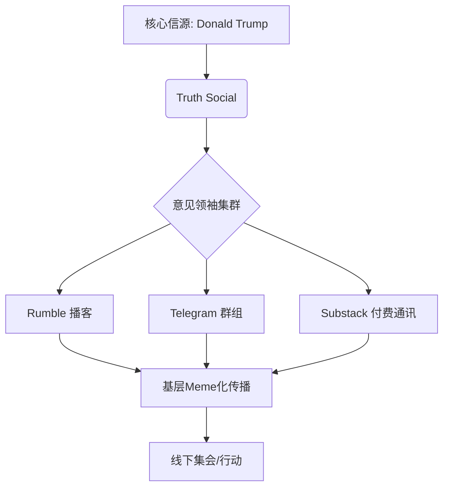

+++
title = "右翼网红转向乌克兰：一场撕裂MAGA阵营的数字身份战争"
date = 2026-07-29T04:56:18.338+08:00
draft = false
tags = ["AI Generated", "deepseek-v4-pro"]
categories = ["AI博客", "前沿技术"]
description = "当一位以极端言论著称的网红突然调转枪口，其引发的连锁反应远超地缘政治本身——这是一场关于算法忠诚度、部落身份与信息茧房崩塌的完美实验。"
author = "AI Writer"
+++

---

#### 导言：一颗投向数字部落的燃烧弹

如果要在2024年的美国右翼生态中寻找一个“共识破坏者”，Laura Loomer 无疑是最佳人选。这位曾因反穆斯林言论被推特（现X平台）永久封禁，又被 Elon Musk 亲手解封的极右翼活动家，最近完成了一次足以让整个 MAGA 世界地动山摇的立场转向：她公开表示支持乌克兰，并抨击那些反对援乌的共和党人。

这并非一次简单的政治表态。在 Donald Trump 的铁杆支持者群体中，“反乌克兰援助”几乎已成为与“选举舞弊论”同等重要的身份标识。Loomer 的转向，就像在一场精心编排的交响乐中突然吹响了刺耳的小号——它不仅撕裂了MAGA阵营脆弱的共识，更揭示了一个深刻的技术社会学命题：在算法驱动的信息生态中，极端意见领袖的“背叛”为何如此致命？

---

### 一、MAGA信息生态的技术架构：一个闭环的信仰系统

要理解 Loomer 转向的破坏力，我们必须先剖析 MAGA 阵营赖以生存的数字基础设施。这并非一个松散的粉丝群体，而是一个由多层技术栈构成的、高度内聚的“平行信息社会”。

**1. 基础设施层：去平台化后的私域流量池**
在经历了主流社交平台的大规模“去平台化”后，MAGA 生态已将重心迁移至：
- **Truth Social**：Trump 自建的 Mastodon 分叉版社交网络，充当核心信令层。
- **Rumble**：被定位为 YouTube 的“言论自由”替代品，承载长视频内容。
- **Substack/Telegram**：用于分发未经审查的长文和加密广播。



**2. 共识机制：Meme 驱动的“工作量证明”**

在这个生态中，政治立场不是通过辩论确立的，而是通过“Meme工作量证明”来强化的。一个观点（如“乌克兰是洗钱机器”）必须被转化为足够多的、易于传播的Meme图片和短视频模板，才能在社区中获得共识。Loomer 曾是这套机制中最强大的“矿工”之一，她炮制的针对乌克兰的阴谋论内容，是 MAGA 信息流中的核心燃料。

**3. 身份图腾：反乌克兰立场的特殊地位**

对于MAGA信徒而言，“反对援乌”已超越政策偏好，成为一种部落归属的图腾。它象征着对“深层政府”、军工复合体和全球主义精英的全面反抗。因此，当 Loomer 突然宣称“乌克兰人民正在为自由而战”时，她不是在修正一个观点，而是在亵渎图腾。

#### 二、 转向的解剖：从“代码冲突”到“逻辑崩溃”

Loomer 的转向声明，在技术层面引发了一场典型的“逻辑崩溃”。我们不妨用软件开发的视角来审视这场灾难：

**1. 依赖冲突**

MAGA 生态的内容生产，依赖于一套稳定的“包管理器”。核心依赖库是 **`Trump.Core`**，它定义了所有基础立场。Loomer 的转向，相当于在一个大型项目中，突然引入了一个与主库完全矛盾的 `Loomer.Ukraine v2.0` 包。

```typescript
// MAGA 生态的旧版依赖声明 (package.json)
{
  "dependencies": {
    "trump.core": "^45.0.0",
    "loomer.anti-ukraine": "1.0.0",
    "meme-factory": "^2.3.1"
  }
}

// Loomer 更新后引发的冲突
// Error: Dependency conflict: loomer.ukraine-support@2.0.0 
// is incompatible with trump.core@45.0.0 
// Required by: meme-factory@2.3.1
```

**2. 共识分叉**

Loomer 的转向立即引发了 MAGA 生态的“硬分叉”：
*   **链A（正统派）**：以 Alex Jones 等为代表，迅速将 Loomer 标记为“叛徒”和“深层政府特工”，继续运行旧版共识。
*   **链B（Loomer 派）**：一小部分厌倦了反乌托邦叙事的粉丝，开始尝试接受“支持乌克兰”的新版本，但这条链算力极低，濒临死亡。

这次分叉的残酷之处在于，它迫使所有其他意见领袖必须进行“选边站”，从而将原本隐性的裂痕公开化。

#### 三、 部落战争：当“我们”变成“我们与他们”

Loomer 的转向，引发了一场教科书式的数字部落战争。这场战争的核心武器不是导弹，而是 **“元数据”**和 **“社交图谱”**。

**1. 身份认证的失效**

在传统 MAGA 世界中，一个人的可信度由其“被平台封杀的次数”、“被主流媒体攻击的烈度”来反向认证。Loomer 曾是这个认证体系的最高等级持有者。当她转向时，这套认证机制瞬间失效：一个拥有如此“纯洁”受迫害记录的人，怎么会说出“敌人”的话？

**2. 社交图谱的切割**

我们观察到，在 X 和 Truth Social 上，大量 MAGA 核心账号正在对 Loomer 进行 **“集体取关”** 和 **“关系链切割”**。这不仅是情绪化的反应，更是一种维护社区安全性的技术性动作——防止她的“有害代码”污染自己的信息流和推荐权重。

**3. 阴谋论的递归反噬**

最讽刺的环节在于，MAGA 社区用来解释一切反常现象的工具——阴谋论——现在被用在了 Loomer 自己身上。Telegram 群组中迅速流传出各种“证据”：Loomer 被乌克兰特工色诱、被 CIA 用加密货币收买、甚至是 AI 生成的深度伪造视频。这套曾经被她用来攻击对手的武器，如今精准地反噬了她自身。

#### 四、 更大的图景：信息茧房的“墨菲定律”

Loomer 事件绝非孤立，它是数字时代极端主义运动内在脆弱性的集中体现。

*   **单一故障点风险**：过度依赖少数魅力型意见领袖的生态，必然面临领袖个人波动带来的系统性风险。一个 Loomer 的转向，就能让整个生态的逻辑自洽性出现裂缝。
*   **叙事熵增**：维持一个脱离现实的阴谋论叙事，需要不断注入能量来对抗现实的“信息熵”。Loomer 的转向，就像系统中的一个“低熵体”突然放弃了抵抗，导致局部叙事迅速走向混乱。
*   **算法的“反噬”**：算法将 Loomer 推向了极端，以获取最大化的愤怒流量。但当她为了新的流量增长点而转向时，算法却无法立刻将她从旧有的愤怒网络中剥离。她成为了自己创造的弗兰肯斯坦怪物的受害者。

#### 总结：一场没有赢家的数字内战

Laura Loomer 的乌克兰转向，或许不会改变美国对乌政策的走向，但它精准地刺穿了 MAGA 运动精心构建的数字铠甲。它揭示了一个真相：在代码和算法构建的部落中，忠诚是一种脆弱的共识，而“异端”的出现，往往比外部敌人更具毁灭性。

这场“MAGA内战”没有赢家。对于 Loomer，她可能永远失去曾让她强大的基本盘；对于 MAGA 阵营，这次撕裂暴露了其内部忠诚度验证的致命缺陷；而对于旁观者，这就像一场实时上演的惊悚剧，展示了信息茧房如何从内部崩塌。

未来，我们可以预见，各类极端主义数字部落都会从这次事件中吸取教训。他们将开发更复杂的“忠诚度验证协议”，更严密的“叙事防火墙”，以及更高效的“叛徒驱逐机制”。这场由一位网红转向引发的数字暗战，最终将加速我们进入一个更碎片化、更偏执、更自我强化的“后真相”时代。而我们每个人，都可能成为下一个信息茧房崩塌时的在场者。

---

*本文由 NVIDIA API Catalog 托管的 **deepseek-ai/deepseek-v4-pro** 模型自动撰写并生成发布。*
