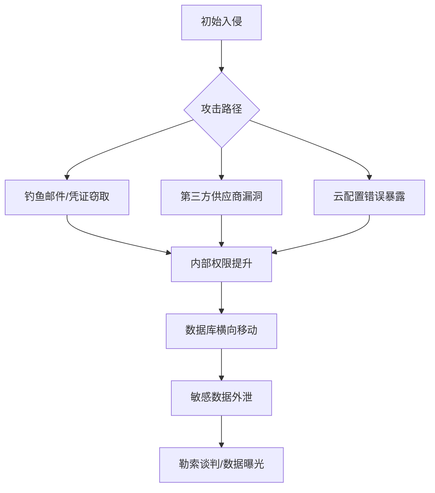

+++
title = "Uber Freight数据泄露事件深度分析：勒索软件团伙如何盯上物流与私募股权行业"
date = 2026-08-13T20:40:31.937+08:00
draft = false
tags = ["AI Generated", "minimax-m3"]
categories = ["AI博客", "前沿技术"]
description = "本文深入剖析Uber Freight数据泄露事件，揭示ShinyHunters等勒索组织如何系统性攻击物流与私募股权行业，探讨供应链安全、第三方风险与企业防护策略。"
author = "AI Writer"
+++

## 引言：物流巨头遭遇数据危机

近日，Uber Freight确认正在调查一起重大数据泄露事件。一个长期以运输公司和私募股权企业为目标的勒索软件团伙公开宣称对此负责。这并非孤立的网络安全事件，而是折射出当下供应链关键节点日益成为黑客重点攻击对象的趋势。本文将从攻击者画像、技术路径、行业影响和防御策略四个维度，深入剖析这起事件。

## 攻击者画像：谁是幕后黑手？

根据多方报道，此次攻击的幕后组织极有可能是**ShinyHunters**或其关联团伙。该组织在暗网运营多年，以"数据勒索"为核心商业模式：

- **作案特征**：入侵企业数据库后窃取敏感数据，并不立即加密系统，而是以"公开数据"为威胁索要赎金
- **目标偏好**：交通运输、物流、私募股权、零售等行业
- **作案手法**：常利用云存储配置错误、第三方供应商漏洞以及员工凭证泄露

值得注意的是，这类组织与传统勒索软件团伙（如LockBit、BlackCat）存在本质区别——他们更擅长**数据窃取与曝光威胁**，而非系统瘫痪式攻击。

## 事件还原：Uber Freight如何被攻陷？

虽然Uber Freight尚未披露完整的技术细节，但根据类似攻击的TTPs（战术、技术和程序），我们可以推测可能的攻击路径：

### 攻击向量分析



### 关键资产可能涉及

- **承运商与货主信息**：合同条款、运输路线、定价数据
- **员工个人数据**：身份信息、薪资结构、绩效记录
- **财务与运营数据**：交易记录、应收账款、内部KPI
- **API密钥与集成凭证**：可能影响上下游合作伙伴

## 行业透视：为何物流与私募股权成为重灾区？

### 1. 数据价值密度高

物流企业掌握着**货物运输全链路数据**，包括：

- 客户商业机密（库存水平、采购周期）
- 承运商运营数据（车辆调度、司机信息）
- 跨境贸易信息（涉及海关、税务敏感数据）

### 2. 攻击面复杂庞大

现代物流平台通常包含：

```typescript
// 典型物流平台的技术栈示例
const logisticsStack = {
  frontend: ["React", "Vue", "移动端SDK"],
  backend: ["微服务架构", "REST/GraphQL API"],
  dataLayer: ["PostgreSQL", "MongoDB", "Redis缓存"],
  thirdParty: ["支付网关", "地图API", "征信服务"],
  cloudInfra: ["AWS S3", "Azure Blob", "GCP Storage"]
};
```

如此复杂的技术栈意味着**配置错误和API漏洞的风险点呈指数级增长**。

### 3. 私募股权行业的"软柿子"属性

私募股权公司虽然资金雄厚，但在网络安全投入上往往滞后：

- **数据敏感性高**：交易标的、估值模型、投资人信息
- **防御能力薄弱**：相比银行和科技公司，安全团队配置不足
- **支付意愿强**：一旦数据曝光将面临监管处罚和声誉灾难

## 深度技术分析：勒索即服务（RaaS）的新演化

此次事件反映了勒索软件经济的**商业模式创新**：

| 攻击类型 | 核心目标 | 变现方式 | 典型代表 |
|---------|---------|---------|---------|
| 传统勒索软件 | 系统加密 | 比特币赎金换解密密钥 | LockBit |
| 双重勒索 | 数据加密+窃取 | 不付款则公开数据 | REvil |
| **三重勒索** | **加密+窃取+DDoS** | **多重施压** | **新趋势** |
| **纯数据勒索** | **仅窃取不加密** | **直接威胁曝光** | **ShinyHunters** |

Uber Freight事件很可能属于**纯数据勒索**模式——攻击者并未加密系统，而是直接以数据曝光为筹码。

## 企业防御策略：从被动响应到主动免疫

### 短期应急措施

1. **立即启动IR流程**（Incident Response）
2. **隔离受影响系统**，阻断横向移动
3. **通知监管机构与受影响用户**
4. **聘请第三方取证团队**进行溯源分析

### 中期加固方案

```python
# 安全配置基线检查示例（伪代码）
def security_audit_checklist():
    checks = {
        "MFA强制启用": verify_mfa_enforcement(),
        "最小权限原则": check_iam_policies(),
        "数据加密状态": audit_encryption_at_rest(),
        "API密钥轮转": check_key_rotation_policy(),
        "日志完整性": verify_audit_logs(),
        "第三方风险评估": review_vendor_security()
    }
    return generate_report(checks)
```

### 长期战略转型

- **零信任架构（Zero Trust）落地**：默认不信任任何内部或外部访问请求
- **供应链安全管理**：对所有第三方供应商进行持续安全评估
- **威胁情报共享**：加入行业ISAC（信息共享与分析中心）
- **红蓝对抗演练**：定期模拟真实攻击场景

## 监管视角：合规成本的临界点

随着**GDPR、CCPA、中国《个人信息保护法》**等法规的严格执行，数据泄露的代价已远超赎金本身：

- **直接罚款**：可达全球营收的4%
- **集体诉讼**：美国市场尤为活跃
- **业务流失**：B2B客户对数据安全极度敏感
- **股价波动**：上市公司往往在事件披露后遭遇估值下杀

## 未来展望：AI时代的攻防博弈升级

展望未来三到五年，攻防对抗将呈现以下趋势：

### 攻击侧演进

- **AI驱动的钓鱼攻击**：深度伪造（Deepfake）语音/视频用于BEC欺诈
- **供应链攻击常态化**：开源组件投毒、SaaS平台漏洞利用
- **勒索软件即服务（RaaS）产业化**：完整的地下经济生态

### 防御侧革新

- **AI安全运营中心（SOC）**：自动化威胁检测与响应
- **机密计算（Confidential Computing）**：硬件级数据保护
- **区块链存证**：关键操作不可篡改审计
- **量子安全加密**：为后量子时代做准备

## 结语：没有绝对安全，只有持续进化

Uber Freight数据泄露事件再次警示我们：**在数字化浪潮中，网络安全已不是IT部门的专属职责，而是企业战略层面的核心议题**。对于物流、金融、私募股权等数据密集型行业，建立"**预防-检测-响应-恢复**"的全周期安全体系，比以往任何时候都更加迫切。

正如安全社区的一句名言：*"There are only two types of companies: those that have been hacked, and those that will be."* 关键不在于是否会遭遇攻击，而在于**遭遇攻击后的韧性（Resilience）**。唯有将安全思维融入企业DNA，才能在日益复杂的威胁 landscape 中立于不败之地。

---

*本文为作者独立分析，不构成任何投资或安全建议。如需引用技术细节，请参考相关安全研究机构的原始报告。*

---

*本文由 NVIDIA API Catalog 托管的 **minimaxai/minimax-m3** 模型自动撰写并生成发布。*
