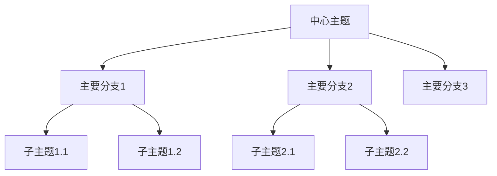

+++
title = "高效学习笔记法：构建个人知识体系"
date = 2025-06-18T16:45:00+08:00
draft = false
tags = ["学习方法", "笔记系统", "知识管理", "个人成长"]
categories = ["学习笔记"]
author = "安卓人"
description = "介绍如何建立高效的笔记系统，构建个人知识体系，提高学习效率"
summary = "本文详细介绍了多种高效笔记方法，以及如何构建个人知识管理系统，让学习更高效、知识更系统"
keywords = ["学习方法", "笔记系统", "知识管理", "个人成长", "学习效率"]
+++


# 高效学习笔记法：构建个人知识体系

在信息爆炸的时代，如何有效地学习、记录和整理知识，构建自己的知识体系，成为每个人都需要面对的挑战。本文将介绍几种高效的笔记方法，以及如何构建个人知识管理系统，让学习更高效、知识更系统。

## 为什么需要系统化的笔记方法

### 传统笔记的局限性

传统的线性笔记方法存在以下问题：

- **信息孤立**：知识点之间缺乏联系
- **难以检索**：查找特定信息困难
- **被动记录**：只是简单复制，缺乏思考
- **遗忘曲线**：信息随时间快速遗忘

### 系统化笔记的优势

一个好的笔记系统应该具备：

- **关联性**：知识点之间相互连接
- **可检索性**：快速找到所需信息
- **思考性**：促进深度思考和理解
- **长期价值**：构建个人知识资产

## 高效笔记方法介绍

### 1. 康奈尔笔记法

康奈尔笔记法将页面分为三个区域：

```
+------------------------------------------+
|                                          |
|              主笔记区域                  |
|                                          |
|                                          |
+------------------------------------------+
| 关键词/问题区域                           |
+------------------------------------------+
| 总结区域                                  |
+------------------------------------------+
```

**使用方法**：
1. **主笔记区域**：记录课堂或阅读内容
2. **关键词/问题区域**：提炼关键概念和问题
3. **总结区域**：用自己的话总结主要内容

**适用场景**：课堂笔记、读书笔记、会议记录

### 2. 思维导图法

思维导图以中心主题为核心，向外发散连接相关概念：



**优势**：
- 直观展示知识结构
- 促进创造性思维
- 便于记忆和理解

**适用场景**：概念梳理、创意构思、项目规划

### 3. 卡片盒笔记法（Zettelkasten）

卡片盒笔记法由德国社会学家尼克拉斯·卢曼发展，核心思想是创建相互连接的笔记卡片：

**核心原则**：
1. **原子性**：每张卡片只记录一个想法
2. **自包含**：每张卡片内容完整独立
3. **链接性**：卡片之间相互链接
4. **索引性**：建立索引系统

**实践方法**：
- 每张卡片给唯一标识
- 用自己的话表达想法
- 主动寻找卡片间的联系
- 定期回顾和重组

### 4. PARA方法

PARA方法由Tiago Forte提出，将所有信息分为四类：

- **P**rojects（项目）：有明确截止日期的短期任务
- **A**reas（领域）：需要长期维护的标准
- **R**esources（资源）：未来可能有用的主题或兴趣
- **A**rchives（存档）：已完成或不活跃的项目和领域

## 构建个人知识管理系统

### 第一步：选择合适的工具

根据个人需求选择合适的工具：

| 工具类型 | 推荐工具 | 优势 | 劣势 |
|---------|---------|------|------|
| 本地应用 | Obsidian, Roam Research | 数据隐私，离线使用 | 设备同步复杂 |
| 云端应用 | Notion, Evernote | 多设备同步，协作方便 | 依赖网络，隐私风险 |
| 简单工具 | OneNote, Apple Notes | 简单易用，免费 | 功能有限，扩展性差 |

### 第二步：设计知识结构

建立适合你自己的知识分类体系：

```markdown
## 我的知识结构

### 1. 学习领域
- 编程技术
  - 前端开发
  - 后端开发
  - 数据库
- 语言学习
  - 英语
  - 日语
- 设计技能
  - UI设计
  - 平面设计

### 2. 工作领域
- 项目管理
- 团队协作
- 客户沟通

### 3. 生活领域
- 健康管理
- 财务规划
- 人际关系
```

### 第三步：建立笔记流程

创建一套标准化的笔记流程：

1. **收集**：快速捕获想法和信息
2. **处理**：整理、分类和标记
3. **连接**：建立知识点之间的联系
4. **提炼**：总结和创造新知识
5. **分享**：输出和应用知识

### 第四步：定期维护

建立定期回顾和维护机制：

- **每日回顾**：整理当天笔记
- **每周回顾**：连接本周笔记，寻找模式
- **每月回顾**：重组知识结构，清理冗余
- **每季度回顾**：评估系统有效性，调整方法

## 实践技巧与最佳实践

### 1. 建立笔记习惯

- **固定时间**：每天固定时间整理笔记
- **随时随地**：使用手机快速记录想法
- **及时处理**：避免笔记堆积

### 2. 提高笔记质量

- **用自己的话**：避免直接复制粘贴
- **添加上下文**：记录笔记的背景和来源
- **多角度思考**：从不同角度理解同一概念

### 3. 增强知识连接

- **主动寻找联系**：思考不同知识点之间的关系
- **使用标签系统**：创建多维度的分类
- **建立索引**：为重要概念创建索引页

### 4. 促进知识输出

- **定期写作**：将笔记转化为文章
- **分享交流**：与他人讨论和分享
- **实践应用**：将知识应用到实际项目中

## 数字工具推荐

### 笔记应用

1. **Obsidian**
   - 本地存储，数据安全
   - 强大的链接功能
   - 丰富的插件生态

2. **Notion**
   - 全能型工作空间
   - 强大的数据库功能
   - 优秀的协作功能

3. **Roam Research**
   - 双向链接的先驱
   - 强大的图谱视图
   - 适合深度思考

### 辅助工具

1. **Zotero**：文献管理和引用
2. **Readwise**：高亮和笔记同步
3. **Anki**：间隔重复记忆
4. **Scrivener**：长文写作工具

## 克服常见挑战

### 信息过载

**问题**：收集太多信息，无法处理。

**解决方案**：
- 设定明确的学习目标
- 限制信息来源
- 定期清理和筛选

### 知识孤岛

**问题**：知识点之间缺乏联系。

**解决方案**：
- 主动寻找知识点之间的联系
- 使用思维导图梳理关系
- 定期回顾和重组笔记

### 缺乏坚持

**问题**：难以长期坚持笔记习惯。

**解决方案**：
- 从小习惯开始
- 设定奖励机制
- 找到笔记的价值和乐趣

## 结语

构建个人知识体系是一个长期的过程，需要不断实践和调整。选择适合自己的笔记方法，建立有效的知识管理系统，并坚持长期实践，你将能够更高效地学习、更系统地掌握知识，最终构建起属于自己的知识资产。

记住，最好的笔记系统不是最复杂的系统，而是你能长期坚持使用的系统。从今天开始，选择一种方法，建立你的第一个笔记，开启你的知识管理之旅吧！

---

*你有什么高效的笔记方法或知识管理技巧？欢迎在评论区分享你的经验！*